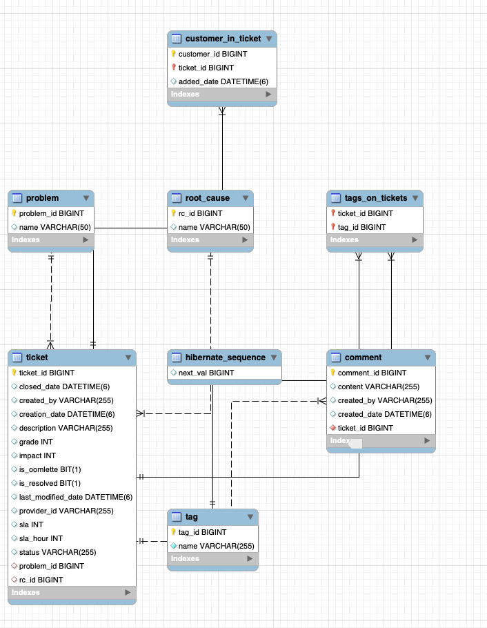

# Customer Escalations Management - Chickenfarms 

## Run the System
We can easily run the whole with only a single command:
```bash
docker-compose up
```

Docker will pull the MySQL and Spring Boot images (if our machine does not have it before).

The services can be run on the background with command:
```bash
docker-compose up -d
```

## Stop the System
Stopping all the running containers is also simple with a single command:
```bash
docker-compose down
```
If you need to stop and remove all containers, networks, and all images used by any service in <em>docker-compose.yml</em> file, use the command:
```bash
docker-compose down --rmi all
```

## Data model 



## Testing with Postman 
###Main end point -  

- #### Create Ticket
```bash

POST: /escalation-management/ticket
 request:

    {
        "description": String,
        "problem": Long,
        "createdBy": String,
        "customers": Long[],
        "provider": String
    }
 response:
{
    "message": String,
    "context": [
        {
            "ticketNumber": Long,
            "description": String,
            "provider": String,
            "createdBy": String,
            "lastModifiedDate": String,
            "status": String,
            "problem": String,
            "rootCause":String,
            "closedDate": String,
            "tags": List<String>,
            "impact": int,
            "resolved": boolean
        }
    ]
}
```
- #### Split Ticket
```bash

POST: /ticket/{ticket_id}}/split/{root_cause_id}/{customer_id}
```
- #### Update Ticket
```bash
POST : /ticket/{ticket_id}/comment
{
    "comment": String,
    "createdBy": String
}
```
- #### Add Customer 
```bash
POST : /ticket/{ticket_id}/{Customer_id}
```

- #### Add Tag Ticket
```bash
POST : /ticket/{ticket_id}/tag?tagName=
```

- #### Move Ticket to Ready
```bash

Put: ticket/{ticket_id}/ready/{root_cause_id}
{
  "description": String,
  "problem": Long,
  "createdBy": String,
  "customers": Long[],
  "provider": String
}
```

- #### Close Ticket
```bash
PUT : ticket/{ticket_id}/close
{
  "closingComment":String,
    "isResolved": boolean
}
```

- #### Update Ticket
```bash
PUT : ticket/{ticket_id}
{
    "description":String,
    "problem":String
}
```
- #### Get filtered Tickets
```bash
GET : /escalation-management/tickets/filter/{pageNum}?status=&tag=&provider=&problem=&rootCause=
```
- #### Get Ticket
```bash
GET : ticket/{ticket_id}
```

- #### Get customers
```bash
GET : ticket/{ticket_id}/customers
```
- #### Get comments
```bash
GET : ticket/{ticket_id}/comments
```


#Check This Lucidchart for App design
https://lucid.app/lucidchart/30438839-7721-4931-87cb-23a99ebf8a47/edit?from_docslist=true&invitationId=inv_0b218176-b26e-4002-be7f-95406815f37a&page=0_0#

